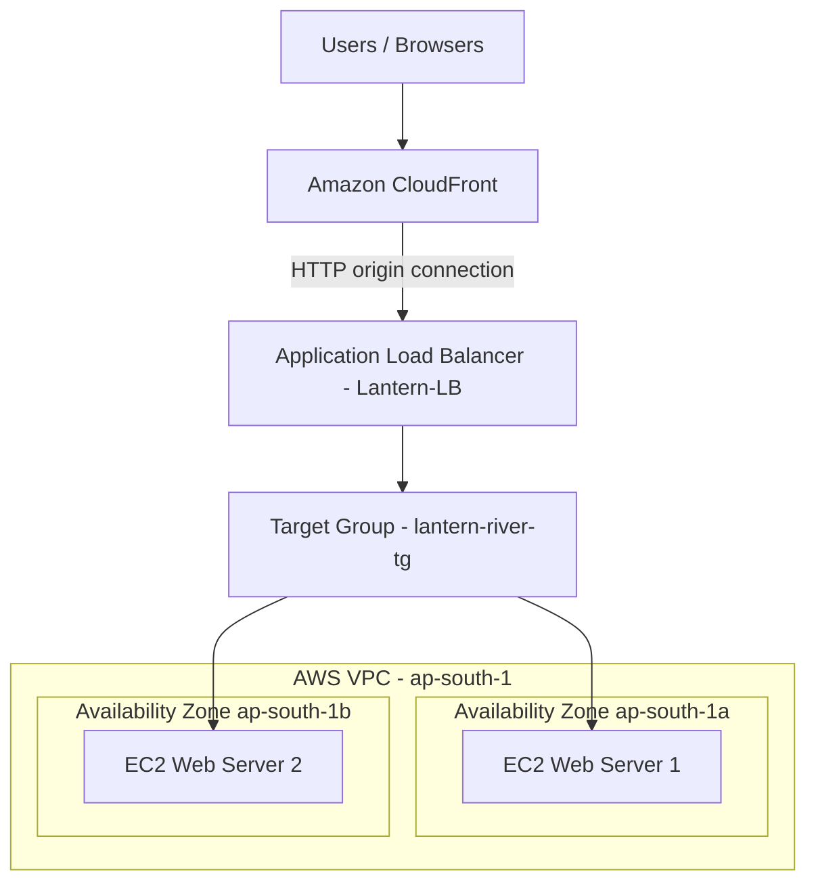

# AWS Global Content Delivery Architecture

```mermaid
flowchart TD
    U[Users / Browsers]
    CF[Amazon CloudFront]
    ALB[Application Load Balancer - Lantern-LB]
    TG[Target Group - lantern-river-tg]

    subgraph VPC["AWS VPC - ap-south-1"]
        subgraph AZA["Availability Zone ap-south-1a"]
            EC2A[EC2 Web Server 1]
        end

        subgraph AZB["Availability Zone ap-south-1b"]
            EC2B[EC2 Web Server 2]
        end
    end

    U --> CF
    CF -->|HTTP origin connection| ALB
    ALB --> TG
    TG --> EC2A
    TG --> EC2B
```
